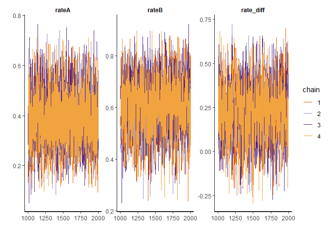
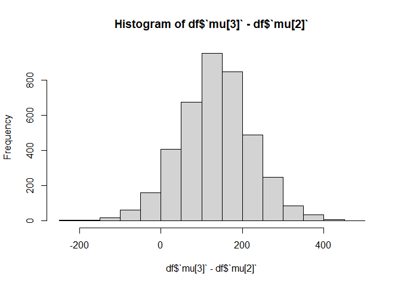

Tutorial on bayesian analysis
================
Christian Barz
24-08-2020, last update: 2020-12-03

  - [introduction](#introduction)
      - [summary](#summary)
      - [initial setup](#initial-setup)
      - [reproducibility](#reproducibility)
  - [approximative bayesian computation and
    MCMC](#approximative-bayesian-computation-and-mcmc)
      - [introduction](#introduction-1)
      - [approximate Bayesian calculation
        (theory)](#approximate-bayesian-calculation-theory)
      - [An example](#an-example)
      - [Same example using Stan](#same-example-using-stan)
  - [Bayesian case studies using
    Stan](#bayesian-case-studies-using-stan)
      - [summary](#summary-1)
      - [A/B testing (binomial target)](#ab-testing-binomial-target)
      - [A/B testing (continous target)](#ab-testing-continous-target)
      - [A/B testing (outlier detection)](#ab-testing-outlier-detection)
      - [A/B testing (discrete target)](#ab-testing-discrete-target)
      - [different input format](#different-input-format)
      - [different input format II](#different-input-format-ii)
      - [bayesian regression](#bayesian-regression)

# introduction

## summary

This note is meant as an introduction to Bayesian analysis using Stan.

It consist of 3 parts:

1.  The introduction you are reading at the moment followed by initial
    set up steps and remarks on reproducibility. (which you can skip)
2.  An introduction to approximate Bayesian computing, which will
    explain the basic idea of bayesian modeling
3.  Case studies using Stan and bayesian analyis to answer typical
    questions

**For the ones who can not wait, I recommend directly to jump to section
3.**

We remark that most ideas come from [Rasmus
Bååth](http://www.sumsar.net/).

## initial setup

We assume that `R` and `rStan` are installed. Otherwise please have a
look [here](https://mc-stan.org/users/interfaces/rstan).

We will use the following libraries in this report:

``` r
library(pacman)
p_load(
  tidyverse,
  ggplot2,
  rstan
)
```

We will not use `ggplot2` much, because we focus on creating stan models
instead of creating “beautiful” plots\!

In a later incarnation we might replace the default plots by nice
`ggplots`.

For reproducibility please look in the corresponing section.

## reproducibility

``` r
sessionInfo()
```

    ## R version 4.0.2 (2020-06-22)
    ## Platform: x86_64-w64-mingw32/x64 (64-bit)
    ## Running under: Windows 10 x64 (build 19041)
    ## 
    ## Matrix products: default
    ## 
    ## locale:
    ## [1] LC_COLLATE=German_Germany.1252  LC_CTYPE=German_Germany.1252   
    ## [3] LC_MONETARY=German_Germany.1252 LC_NUMERIC=C                   
    ## [5] LC_TIME=German_Germany.1252    
    ## 
    ## attached base packages:
    ## [1] stats     graphics  grDevices utils     datasets  methods   base     
    ## 
    ## other attached packages:
    ##  [1] rstan_2.21.2         StanHeaders_2.21.0-6 forcats_0.5.0       
    ##  [4] stringr_1.4.0        dplyr_1.0.2          purrr_0.3.4         
    ##  [7] readr_1.4.0          tidyr_1.1.2          tibble_3.0.4        
    ## [10] ggplot2_3.3.2        tidyverse_1.3.0      pacman_0.5.1        
    ## 
    ## loaded via a namespace (and not attached):
    ##  [1] Rcpp_1.0.5         lubridate_1.7.9.2  prettyunits_1.1.1  ps_1.4.0          
    ##  [5] assertthat_0.2.1   digest_0.6.27      V8_3.4.0           R6_2.5.0          
    ##  [9] cellranger_1.1.0   backports_1.2.0    reprex_0.3.0       stats4_4.0.2      
    ## [13] evaluate_0.14      httr_1.4.2         pillar_1.4.7       rlang_0.4.8       
    ## [17] curl_4.3           readxl_1.3.1       rstudioapi_0.13    callr_3.5.1       
    ## [21] rmarkdown_2.5      loo_2.3.1          munsell_0.5.0      broom_0.7.2       
    ## [25] compiler_4.0.2     modelr_0.1.8       xfun_0.19          pkgconfig_2.0.3   
    ## [29] pkgbuild_1.1.0     htmltools_0.5.0    tidyselect_1.1.0   gridExtra_2.3     
    ## [33] codetools_0.2-16   matrixStats_0.57.0 fansi_0.4.1        crayon_1.3.4      
    ## [37] dbplyr_2.0.0       withr_2.3.0        grid_4.0.2         jsonlite_1.7.1    
    ## [41] gtable_0.3.0       lifecycle_0.2.0    DBI_1.1.0          magrittr_2.0.1    
    ## [45] scales_1.1.1       RcppParallel_5.0.2 cli_2.2.0          stringi_1.5.3     
    ## [49] fs_1.5.0           xml2_1.3.2         ellipsis_0.3.1     generics_0.1.0    
    ## [53] vctrs_0.3.5        tools_4.0.2        glue_1.4.2         hms_0.5.3         
    ## [57] parallel_4.0.2     processx_3.4.4     yaml_2.2.1         inline_0.3.16     
    ## [61] colorspace_2.0-0   rvest_0.3.6        knitr_1.30         haven_2.3.1

# approximative bayesian computation and MCMC

## introduction

In principle whenever we do bayesian analysis or modeling we need 3
things:

1.  data
2.  a generative model and
3.  a prior distribution

In this section we will explain how these ingredients are used to
determine a posteriori distribution.

For the ones who like real world examples we pick up the example from
Rasmus, in which a company has run two marketing campains and want to
know which one is “better”. Here “better” can mean more new customers or
as campains do cost, which campain results in an higher revenue.

To be more concrete, we assume that the campains had the following
impact:

  - campain A : 6 of 16 person became costumers
  - campain B : 10 of 16 person became customers

Hence some question could be:

  - Question 1: What is the rate of new costumers if we apply the
    campain A on a larger number of people?
  - Question 2: What is the problability that campain A is better than
    campain B?
  - Question 3: If we apply campain on 100 people, how many new
    costumers we might have.
  - Question 4: Assume the campain have different cost, which campain
    leads to a higher revenue?

## approximate Bayesian calculation (theory)

Assume we have the three ingredients for a bayesian data analysis, that
is data, a generative model and a prior distribution. Hence the question
is:

1.  how do we fit the model?
2.  how do I use it to answer my question?

To do so we use a method called a approximate Bayesian computation,
which will fit the bayesian model. The methods

1.  we simulate data, i.e. we draw samples from the prior distribution
    and put them into the model to generate data
2.  we filter the tuples `(parameter, generated data)` to `generated
    data = observed data`
3.  the remaining set of parameters represents a sample of the posterior
    distribution and can be used to answer question.

So let us gather the ingredients and get our hands dirty.

We recall that we have data, i.e. six of 16 person (respk. 10 of 16
person) became a customer after campain A (respk. campain B).

A first guess would be that
 of 
persons become a costumer, but that is just a point estimate.

Our generative model should predict, how many `k` of `n` persons became
a customer. This is precisely what the binomial distribution does. It is
defined as follows:

  
 = \\binom{n}{k}p^k(1-p)^{n-k}
")  

where

  - `n` is the number of trials
  - `k` is the number of successful events
  - `p` is the probability of success (its value comes from the prior
    distribution)

For simplicity we assume that the prior distribution is uniform, which
can be interpreted that it is equally likely that a person becomes a
customer.

Of course that is somehow naive and I believe obvious if we look at the
two extreme cases: - no one is interested in our product,
i.e.  and -
everyone is interested in our product,
i.e. .

In a next step we should think of something more advance as define the
prior distribution as (linear) combination of other distributions or use
a uniform distribution which has strict boarders like   

")  

### Remarks on Approximate Bayesian computations

The method is conceptional simple, that is why we spend time explaining
it. But is computational intensive, that is why we will learn more
advance techniques later.

However lets get our hands dirty in the next tab.

## An example

Let us recall the setting: we have run two campains. The observation
from campain A were 6 of 16 person became customer.

``` r
# defining some parameters
number_of_samples <- 10000

trials <- 16
observation <- 6

# draw samples from the prior distribution
prior <- runif(n = number_of_samples, min = 0, max = 1)

# define generative model
generative_model <- function(trials, p){
  return(rbinom(n = 1, size = trials, prob = p))
}

# simmulate data
simmulated_data = tibble(prior) %>%
  mutate(costumers = sapply(prior, function(x) generative_model(trials = trials, p = x))) %>%
  # restrict data to observation
  filter(costumers == observation) %>%
  # round the prior for a later analysis
  mutate(posterior = round(prior, digits = 2))
```

Let us have a look at the posterior distribution and some statistical
measures:

``` r
hist(simmulated_data$posterior)
```

<!-- -->

``` r
summary(simmulated_data$posterior)
```

    ##    Min. 1st Qu.  Median    Mean 3rd Qu.    Max. 
    ##  0.1000  0.3100  0.3900  0.3906  0.4625  0.7500

We see that the “naive” guess
 was not a bad choice, indeed it will be the maximum
likelihood which one will allways recieve using a uniform prior.

however most intestingly would be a credibility intervall, i.e. we are
95% certain that after campain A

``` r
quantile(simmulated_data$posterior, c(0.025, 0.975))
```

    ##    2.5%   97.5% 
    ## 0.19000 0.61125

percent of the people will be new costumers.

However one big benefit arises when we like to answer the other
questions:

### Question : What’s the probability that campain A is better than campain B?

We assume that camapin B has a success rate of 20%.

The question can be reformulated as follows: In how many cases do we
have a better success rate than 20%.

``` r
success_campain_B <- 0.2

simmulated_data %>% 
  filter(posterior > success_campain_B) %>%
  nrow(.) / nrow(simmulated_data)
```

    ## [1] 0.966443

### Question : If campain A was used on 100 people how many new costumers we will have?

Therefore we use the posterior distribution

``` r
more_people <- simmulated_data %>%
  pull(posterior) %>%
  sapply(., function(x) generative_model(trials = 100, p = x))

hist(more_people)
```

<!-- -->

``` r
summary(more_people)
```

    ##    Min. 1st Qu.  Median    Mean 3rd Qu.    Max. 
    ##    6.00   31.00   39.00   39.35   47.00   79.00

## Same example using Stan

In a previous tab we used approximate Bayesian Computation to do some
data analysis to answer some Question from A/B testing. Now we the same
using more advanced techniques, precisely using Monte Carlo Marcov Chain
algorithms (MCMC) from Stan.

Let us recall the observations:

  - In campain A: 6 of 16 people became customers
  - In campain B: 10 of 16 people became customers

<!-- end list -->

``` r
# define Stan model
model <- "
# We define what data we will use in our model
data {
  # Number of trials
  int nA;
  int nB;
  # Number of successes
  int sA;
  int sB;
}

# We define the 'unknowns' aka parameters
parameters {
  real<lower=0, upper=1> rateA;
  real<lower=0, upper=1> rateB;
}

# We define the generative model
model {
  rateA ~ uniform(0, 1);
  rateB ~ uniform(0, 1);
  sA ~ binomial(nA, rateA);
  sB ~ binomial(nB, rateB);
}

# In the generated quantiles block you can calculate 'derivatives' of
# the parameters. As we are interested if campain B is better than A, we consider their difference
generated quantities {
  real rate_diff;
  rate_diff = rateB - rateA;
}
"

data <- list(nA = 16, nB = 16, sA = 6, sB = 10)

# compiling and producing posterior samples from the model
samples <- stan(model_code = model, data = data)
```

``` r
# plotting and summarising the posterior distribution
samples
```

    ## Inference for Stan model: 357b2d55b469fc48625f743f2d24a438.
    ## 4 chains, each with iter=2000; warmup=1000; thin=1; 
    ## post-warmup draws per chain=1000, total post-warmup draws=4000.
    ## 
    ##             mean se_mean   sd   2.5%    25%    50%    75%  97.5% n_eff Rhat
    ## rateA       0.39    0.00 0.11   0.18   0.30   0.38   0.46   0.62  3191    1
    ## rateB       0.61    0.00 0.11   0.39   0.54   0.62   0.69   0.81  3526    1
    ## rate_diff   0.22    0.00 0.16  -0.09   0.12   0.23   0.33   0.53  3095    1
    ## lp__      -25.10    0.03 1.07 -28.04 -25.49 -24.76 -24.37 -24.08  1661    1
    ## 
    ## Samples were drawn using NUTS(diag_e) at Thu Dec 03 16:41:28 2020.
    ## For each parameter, n_eff is a crude measure of effective sample size,
    ## and Rhat is the potential scale reduction factor on split chains (at 
    ## convergence, Rhat=1).

``` r
traceplot(samples)
```

<!-- -->

The traceplot can be used as a measure to see the convergence of the
marcov chains. Simply said the expected plot should look like random
noise, when everything is fine. Moreover we can also look at the `Rhat`
value in the summary statistic. However we will not spend more time on
this question, as we want to get familiar with Stan.

### Question 1: Which campiain leads to a higher rate of costumers?

We recall that one of our parameters `rateA` and `rateB` were the
probability of becoming a new costumer and that
 was defined as

  
  

hence
 is positive if and only if campain B lead to more new
costumers.

``` r
# we convert the output to a data frame
posterior <- as.data.frame(samples)

sum(posterior$rate_diff > 0) / length(posterior$rate_diff)
```

    ## [1] 0.9215

Hence with \~90% probability the campain B lead to more costumers as
campain A. (We remark that the number above depend on the sampling.)

### Question 2 Test an Hypothesis? (including background knowlegde)

We now want to use a more informative prior and assume we got told: The
rate of new costumers can not

  - be lower than 5% and
  - be higher than 15%.

One practical way is to create a prior distribution using a (linear)
combination of implemented ones, or use the beta distibution and play
around with its parameters until we find something which fits the
hypothesis:

``` r
hist(rbeta(9999, shape1 = 4, shape2 = 40), xlim=c(0, 1), 30)
lines(c(0.05, 0.15), c(0,0), col="red", lwd = 3)
```

<!-- -->

As we saw above the beta distribution with the parameters
")
look promising.

The `rStan` code would be the following

``` r
model_string <- "
data {
  # Number of trials
  int nA;
  int nB;
  # Number of successes
  int sA;
  int sB;
}

parameters {
  real<lower=0, upper=1> rateA;
  real<lower=0, upper=1> rateB;
}

model {  
  rateA ~ beta(4, 40);
  rateB ~ beta(4, 40);
  sA ~ binomial(nA, rateA);
  sB ~ binomial(nB, rateB); 
}

generated quantities {
  real rate_diff;
  rate_diff = rateB - rateA;
}
"

data_list <- list(nA = 16, nB = 16, sA = 6, sB = 10)

# Compiling and producing posterior samples from the model.
stan_samples <- stan(model_code = model_string, data = data_list)
```

``` r
# Plotting and summarizing the posterior distribution
plot(stan_samples)
```

<!-- -->

To answer the question we do the same as before:

``` r
posterior <- as.data.frame(stan_samples)
sum(posterior$rate_diff > 0) / length(posterior$rate_diff)
```

    ## [1] 0.821

Hence campain B can still be considered to be more effective than
campain A with around 80% probability.

### Question 3 Which campain lead to an higher revenue?

Now the example becomes more interesting from a real world point of
view.

We assume we have the following information

  - A new costumer is 1000,- worth.
  - Campain A cost 30,- per person.
  - Campain B cost 300,- per person.

The good thing is, that we don’t have to make any changes to the model
and only need to “post-process” the posterior distribution in posterior.

``` r
posterior <- as.data.frame(stan_samples)
# calculating the estimated posterior profit using method A (or B)
# a cost of 30 kr + the average profit per sent out add
profitA <- -30 + posterior$rateA * 1000 
profitB <- -300 + posterior$rateB * 1000 
hist(profitA)
```

<!-- -->

``` r
hist(profitB)
```

<!-- -->

Just by looking at the distribution it is clear that although campain B
generates more costumers, we likely do not generate more money with it.

However lets do the calculations:

``` r
hist(profitA - profitB)
expected_profit_diff <- mean(profitA - profitB)
abline(v = expected_profit_diff, col = "red", lwd =2)
```

<!-- -->

We conclude that the expected profit with campain A is \~200,- higher
than with campain B.

Of course in the real world we would test more priors and consider a
bigger data set\!

# Bayesian case studies using Stan

## summary

The goal of the following tabs is to get familiar with Stan and learn
basic techniques to tackle typical real life problems.

For the ones who like a concrete example, think of being a farmer. You
like to check weather a certain action is benefitial or not (from a data
point of view).

The examples are made in a way that the complexity rises from one to the
other.

## A/B testing (binomial target)

### Cows and deseases

You want to compare two drugs. Therefore you can 10 cows drug A and 10
cows drug B. Afterwards you measured how many of them got sick.

Hence the resulting data could look like:

``` r
cowA <- c(0, 1, 0, 0, 0, 0, 1, 0, 0, 0)
cowB <- c(0, 0, 1, 1, 1, 0, 1, 1, 1, 0)
```

The idea is to use a Bernoulli distribution as a generative model, as
the Bernoulli distribution is a special case of the binomial
distribution with just one trial. Hence it matches the way the data is
encoded.

Because we are now dealing with vectors, we like to mention 2 ways of
writing things in Stan

  - `int X[n]` defines an array `X` of integers of length `n`
  - `vector[n] X` defines a vector `X` of length `n` which components
    are real numbers

Hence arrays are more general, but note the different in the definition.

``` r
model = "
data {
 # number of observations
 int nA;
 int nB;
 # observations
 int obsA[nA];
 int obsB[nB];
 }
 
parameters {
 real<lower=0, upper=1> theta1;
 real<lower=0, upper=1> theta2;
}

model {
theta1 ~ beta(1,1);
theta2 ~ beta(1,1);
obsA ~ bernoulli(theta1);
obsB ~ bernoulli(theta2);
}

generated quantities {
  real rate_diff;
  rate_diff <- theta1 - theta2;
}
"
# define data
data <- list(obsA = cowA, obsB = cowB, nA = length(cowA), nB = length(cowB))

# compile and produce posterior samples from the model
samples <- stan(model_code = model, data = data)
```

``` r
# plot and summarise the posterior distribution
samples
```

    ## Inference for Stan model: e04e556ea3022593767c47249a22f5f5.
    ## 4 chains, each with iter=2000; warmup=1000; thin=1; 
    ## post-warmup draws per chain=1000, total post-warmup draws=4000.
    ## 
    ##             mean se_mean   sd   2.5%    25%    50%    75%  97.5% n_eff Rhat
    ## theta1      0.25    0.00 0.12   0.06   0.16   0.24   0.33   0.54  2722    1
    ## theta2      0.58    0.00 0.14   0.31   0.49   0.59   0.68   0.83  2786    1
    ## rate_diff  -0.33    0.00 0.18  -0.65  -0.47  -0.34  -0.21   0.05  2560    1
    ## lp__      -15.95    0.03 1.03 -18.62 -16.39 -15.62 -15.21 -14.92  1665    1
    ## 
    ## Samples were drawn using NUTS(diag_e) at Thu Dec 03 16:42:37 2020.
    ## For each parameter, n_eff is a crude measure of effective sample size,
    ## and Rhat is the potential scale reduction factor on split chains (at 
    ## convergence, Rhat=1).

``` r
plot(samples)
```

<!-- -->

we convert the result to a data frame and look at the posterior
distirbutions

``` r
df <- as.data.frame(samples)
hist(df$theta1)
```

<!-- -->

``` r
hist(df$theta2)
```

<!-- -->

### Question: What is the probability that drug A is less effective than drug B?

``` r
print(paste("drug A is less effectiev than drug B with" ,as.character(mean(df$theta1 < df$theta2)), "percent"))
```

    ## [1] "drug A is less effectiev than drug B with 0.9565 percent"

``` r
hist(df$rate_diff)
```

<!-- -->

## A/B testing (continous target)

In the next example we have given a subset of 10 cows a special diet and
recorded their milk production. In addition we had a control group of 15
cows which got the “usual” food. Let the date be as folllows

``` r
diet_milk <- c(651, 679, 374, 601, 401, 609, 767, 709, 704, 679)
normal_milk <- c(798, 1139, 529, 609, 553, 743, 151, 544, 488, 555, 257, 692, 678, 675, 538)
```

### Question : Does the diet result in a better milk production ?

We assume that the milk production per cow and day is normaly
distributed, i.e.

  

")  

where  is the
mean and  is the standard deviation and `milk` is a vector of length
`n`. Since Stan is partly vectorizes we will see this will not affact
the Stan code much.

We recall that the standard deviation is allways positive, hence we can
put a lower bound on
 in
the Stan code. In particular the same holds for
. Moreover we
use for simplicity a uniform prior for
 and
, as in
particular I am not a farmer at all and lack any prior information. We
assume that 10 cows can not give more than 2000 liter a day.

``` r
# The Stan model as a string.
model <- "
data {
  int n1;
  int n2;
  vector[n1] y1;
  vector[n2] y2;
}

parameters {
  real<lower=0> mu1;
  real<lower=0> mu2;
  real<lower=0> sigma1;
  real<lower=0> sigma2;
}

model {  
  mu1 ~ uniform(0, 2000);
  mu2 ~ uniform(0, 2000);
  sigma1 ~ uniform(0, 1000);
  sigma2 ~ uniform(0, 1000);
  y1 ~ normal(mu1, sigma1);
  y2 ~ normal(mu2, sigma2); 
}

generated quantities {
}
"

diet_milk <- c(651, 679, 374, 601, 401, 609, 767, 709, 704, 679)
normal_milk <- c(798, 1139, 529, 609, 553, 743, 151, 544, 488, 555, 257, 692, 678, 675, 538)
data <- list(y1 = diet_milk, y2 = normal_milk, 
             n1 = length(diet_milk), n2 = length(normal_milk))

# Compiling and producing posterior samples from the model.
samples <- stan(model_code = model, data = data)
```

Let us have a look at the posterior distribution and a summary statistic

``` r
stan_samples
```

    ## Inference for Stan model: 453fdfc0f20255db0b8384037caa95ed.
    ## 4 chains, each with iter=2000; warmup=1000; thin=1; 
    ## post-warmup draws per chain=1000, total post-warmup draws=4000.
    ## 
    ##             mean se_mean   sd   2.5%    25%    50%    75%  97.5% n_eff Rhat
    ## rateA       0.17    0.00 0.05   0.09   0.13   0.16   0.20   0.27  2929    1
    ## rateB       0.24    0.00 0.05   0.14   0.20   0.23   0.27   0.35  3094    1
    ## rate_diff   0.07    0.00 0.07  -0.08   0.02   0.07   0.12   0.21  3044    1
    ## lp__      -60.65    0.03 1.01 -63.40 -61.07 -60.32 -59.93 -59.66  1436    1
    ## 
    ## Samples were drawn using NUTS(diag_e) at Thu Dec 03 16:42:03 2020.
    ## For each parameter, n_eff is a crude measure of effective sample size,
    ## and Rhat is the potential scale reduction factor on split chains (at 
    ## convergence, Rhat=1).

``` r
plot(stan_samples)
```

<!-- -->

But I believe looking at a histogram is more informative

``` r
df <- as.data.frame(samples) %>%
  mutate(mu_diff = mu2 -mu1)

df %>% ggplot(aes(x=mu_diff)) + geom_histogram()
```

<!-- -->

This looks like a normal distribution with a slight shift into the
negative direction. We recall that the difference is negative when when
the diet had an effect. However as the picture is just a basic
histogram, we like to calculate the probabilities:

``` r
print(paste("It is", as.character(mean(df$mu_diff >0)), "likely that a diet has no effect."))
```

    ## [1] "It is 0.389 likely that a diet has no effect."

``` r
print(paste("It is", as.character(mean(df$mu_diff <0)), "likely that a diet has an effect."))
```

    ## [1] "It is 0.611 likely that a diet has an effect."

Hence it is likely that the diet has a positive effect but the
experiment does not give a strong evidence.

## A/B testing (outlier detection)

Now be more realistic and include some outliers. They may occur because
you play cards and drink with your friends every thursday. We assume you
documented the following data:

``` r
diet_milk <- c(651, 679, 374, 601, 4000, 401, 609, 767, 3890, 704, 679)
normal_milk <- c(798, 1139, 529, 609, 553, 743, 3,151, 544, 488, 15, 257, 692, 678, 675, 538)
```

A possible trick in this situation is to supplement the normal
distribution with wider tails, such that it is more sensitive to the
central values and far away values are less likely.

A good choice can be the t-distribution, which is like the normal but
has a third parameter. The parameter is called the “degrees of freedom”
and lower “degrees of freedom” lead to wider tails and when the
parameter is larger than about 50 the t-distribution is practically the
same as the normal. Lets draw a basic picture of the t-distribution with
a degree of freedom equal to 3.

``` r
hist(rt(n= 1000, df = 3))
```

<!-- -->

``` r
# the Stan model
model <- "
data {
  int n1;
  int n2;
  vector[n1] y1;
  vector[n2] y2;
}

parameters {
  real mu1;
  real mu2;
  real<lower=0> sigma1;
  real<lower=0> sigma2;
}

model {  
  mu1 ~ uniform(0, 2000);
  mu2 ~ uniform(0, 2000);
  sigma1 ~ uniform(0, 1000);
  sigma2 ~ uniform(0, 1000);
  y1 ~ student_t(3, mu1, sigma1);
  y2 ~ student_t(3, mu2, sigma2);
}

generated quantities {
}
"

# the data 
diet_milk <- c(651, 679, 374, 601, 4000, 401, 609, 767, 3890, 704, 679)
normal_milk <- c(798, 1139, 529, 609, 553, 743, 3,151, 544, 488, 15, 257, 692, 678, 675, 538)

data <- list(y1 = diet_milk, y2 = normal_milk, 
             n1 = length(diet_milk), n2 = length(normal_milk))

# compile and draw posterior samples from the model.
samples <- stan(model_code = model, data = data)
```

``` r
stan_samples
```

    ## Inference for Stan model: 453fdfc0f20255db0b8384037caa95ed.
    ## 4 chains, each with iter=2000; warmup=1000; thin=1; 
    ## post-warmup draws per chain=1000, total post-warmup draws=4000.
    ## 
    ##             mean se_mean   sd   2.5%    25%    50%    75%  97.5% n_eff Rhat
    ## rateA       0.17    0.00 0.05   0.09   0.13   0.16   0.20   0.27  2929    1
    ## rateB       0.24    0.00 0.05   0.14   0.20   0.23   0.27   0.35  3094    1
    ## rate_diff   0.07    0.00 0.07  -0.08   0.02   0.07   0.12   0.21  3044    1
    ## lp__      -60.65    0.03 1.01 -63.40 -61.07 -60.32 -59.93 -59.66  1436    1
    ## 
    ## Samples were drawn using NUTS(diag_e) at Thu Dec 03 16:42:03 2020.
    ## For each parameter, n_eff is a crude measure of effective sample size,
    ## and Rhat is the potential scale reduction factor on split chains (at 
    ## convergence, Rhat=1).

``` r
plot(stan_samples)
```

<!-- -->

### Question: How does a diet affect the milk production of cows (including outliers)?

Again we convert the result to a data frame

``` r
df <- as.data.frame(samples) %>%
  mutate(mu_diff = mu2 -mu1)

df %>% ggplot(aes(x=mu_diff)) + geom_histogram()
```

<!-- -->

This looks like again a normal distribution with a slight shift more
than before into the negative direction. We recall that the difference
is negative when when the diet had an effect. However as the picture is
just a basic histogram, we like to calculate the probabilities:

``` r
print(paste("It is", as.character(mean(df$mu_diff >0)), "likely that a diet has no effect."))
```

    ## [1] "It is 0.25525 likely that a diet has no effect."

``` r
print(paste("It is", as.character(mean(df$mu_diff <0)), "likely that a diet has an effect."))
```

    ## [1] "It is 0.74475 likely that a diet has an effect."

No the evidence became stronger, but I would run a larger experiment,
draw more samplpes and use an informative prior or use another model.
For such an example see the next tab.

## A/B testing (discrete target)

We want to use the poison distribution next, which is a typical choice
when dealing with “counted data”. It has one parameter

which stands for the mean of the count. In Stan we would write it as
follows:

  

")  

But lets have a real life example. What you did to the cows you did to
the chicken too, i.e. you put some of them on diet and counted the
number of produced egg per weeks. We are going to model the number of
eggs with a poisson distribution.

Let the data be:

``` r
diet_eggs <- c(6, 4, 2, 3, 4, 3, 0, 4, 0, 6, 3)
normal_eggs <- c(4, 2, 1, 1, 2, 1, 2, 1, 3, 2, 1)
```

### Question : Does the diet had a positive effect on the number of eggs per week?

``` r
# The Stan model
model <- "
data {
  int n1;
  int n2;
  int y1[n1];
  int y2[n2];
}

parameters {
  real<lower=0> lambda1;
  real<lower=0> lambda2;
}

model {  
  lambda1 ~ uniform(0, 100);
  lambda2 ~ uniform(0, 100);
  y1 ~ poisson(lambda1);
  y2 ~ poisson(lambda2); 
}

generated quantities {
}
"

# the data
diet_eggs <- c(6, 4, 2, 3, 4, 3, 0, 4, 0, 6, 3)
normal_eggs <- c(4, 2, 1, 1, 2, 1, 2, 1, 3, 2, 1)
data <- list(y1 = diet_eggs, y2 = normal_eggs, 
             n1 = length(diet_eggs), n2 = length(normal_eggs))

# compile and draw posterior samples from the model
samples <- stan(model_code = model, data = data)
```

``` r
samples
```

    ## Inference for Stan model: 770b97d842f820154c06a1cd67c07a3e.
    ## 4 chains, each with iter=2000; warmup=1000; thin=1; 
    ## post-warmup draws per chain=1000, total post-warmup draws=4000.
    ## 
    ##          mean se_mean   sd  2.5%   25%   50%   75% 97.5% n_eff Rhat
    ## lambda1  3.28    0.01 0.52  2.33  2.92  3.26  3.62  4.36  3470    1
    ## lambda2  1.91    0.01 0.41  1.21  1.62  1.88  2.17  2.79  3432    1
    ## lp__    -1.68    0.02 0.95 -4.15 -2.05 -1.40 -1.01 -0.76  1906    1
    ## 
    ## Samples were drawn using NUTS(diag_e) at Thu Dec 03 16:44:20 2020.
    ## For each parameter, n_eff is a crude measure of effective sample size,
    ## and Rhat is the potential scale reduction factor on split chains (at 
    ## convergence, Rhat=1).

``` r
plot(samples)
```

<!-- -->

Again we convert the result to a data frame:

``` r
df <- as.data.frame(samples) %>%
  mutate(lambda_diff = lambda1 - lambda2)

df %>% ggplot(aes(x=lambda_diff)) + geom_histogram()
```

<!-- -->

We see there a strong evidence that the diet is benefitial:

``` r
print(paste("It is", as.character(mean(df$lambda_diff >0)), "likely that a diet has an effect."))
```

    ## [1] "It is 0.981 likely that a diet has an effect."

## different input format

We now want to implement the same model as from diet example whit the
cows, but we assume that the data is given in a more commeon way as a
data frame, in which on column represents the group.

``` r
df <- data.frame(
  milk = c(651, 679, 374, 601, 401, 609, 767, 709, 704, 679, 798, 1139,
           529, 609, 553, 743, 151, 544, 488, 555, 257, 692, 678, 675, 538),
  group = c(1, 1, 1, 1, 1, 1, 1, 1, 1, 1, 2, 2, 
            2, 2, 2, 2, 2, 2, 2, 2, 2, 2, 2, 2, 2))
```

We can read the data into stan as follows

``` r
data <- list(y = df$milk, x = df$group, n = length(df$milk), 
             n_groups = max(df$group))
```

If we put all together we get the following code chunk:

``` r
# The Stan model
model <- "
data {
  int n;
  int n_groups;
  int x[n];
  vector[n] y;
}

parameters {
  vector[n_groups] mu;
  vector<lower=0>[n_groups] sigma;
}

model {  
  mu ~ uniform(0, 2000);
  sigma ~ uniform(0, 1000);
  y ~ normal(mu[x], sigma[x]);
}

generated quantities {
}
"

df <- data.frame(
  milk = c(651, 679, 374, 601, 401, 609, 767, 709, 704, 679, 798, 1139,
           529, 609, 553, 743, 151, 544, 488, 555, 257, 692, 678, 675, 538),
  group = c(1, 1, 1, 1, 1, 1, 1, 1, 1, 1, 2, 2, 
            2, 2, 2, 2, 2, 2, 2, 2, 2, 2, 2, 2, 2))
data <- list(y = df$milk, x = df$group, n = length(df$milk), 
             n_groups = max(df$group))

# Compiling and producing posterior samples from the model.
samples <- stan(model_code = model, data = data)
```

``` r
samples
```

    ## Inference for Stan model: 026dec997b620e9777fa8d87b499ff2f.
    ## 4 chains, each with iter=2000; warmup=1000; thin=1; 
    ## post-warmup draws per chain=1000, total post-warmup draws=4000.
    ## 
    ##             mean se_mean    sd    2.5%     25%     50%     75%   97.5% n_eff
    ## mu[1]     616.93    0.93 50.76  510.30  586.29  617.50  648.17  717.74  2960
    ## mu[2]     595.94    1.21 64.48  467.95  554.87  595.62  636.57  728.84  2825
    ## sigma[1]  153.37    0.94 45.38   92.37  121.51  144.37  174.93  271.07  2334
    ## sigma[2]  248.86    1.01 51.97  169.62  212.01  241.73  277.41  369.61  2670
    ## lp__     -133.45    0.04  1.52 -137.16 -134.21 -133.10 -132.33 -131.53  1578
    ##          Rhat
    ## mu[1]       1
    ## mu[2]       1
    ## sigma[1]    1
    ## sigma[2]    1
    ## lp__        1
    ## 
    ## Samples were drawn using NUTS(diag_e) at Thu Dec 03 16:44:56 2020.
    ## For each parameter, n_eff is a crude measure of effective sample size,
    ## and Rhat is the potential scale reduction factor on split chains (at 
    ## convergence, Rhat=1).

``` r
plot(samples)
```

<!-- -->

We will not inspect this closer, as in the following tab we will enlarge
the scope.

## different input format II

Let’s keep it brief, as we saw the example multiple times. Assume we
have more than one diet and want to find out the best one. Let the data
be given by :

``` r
df <- data.frame(
  milk = c(651, 679, 374, 601, 401, 609, 767, 709, 704, 679, 798, 1139, 529,
           609, 553, 743, 151, 544, 488, 555, 257, 692, 678, 675, 538, 1061,
           721, 595, 784, 877, 562, 800, 684, 741, 516),
  group = c(1, 1, 1, 1, 1, 1, 1, 1, 1, 1, 2, 2, 2, 2, 2, 2, 2, 2, 2, 2, 2, 2,
            2, 2, 2, 3, 3, 3, 3, 3, 3, 3, 3, 3, 3))
```

### Question : Which diet leads to the highest milk production compared to the others?

``` r
#The Stan model
model <- "
data {
int n;
int n_groups;
int x[n];
vector[n] y;
}

parameters {
vector[n_groups] mu;
vector<lower=0>[n_groups] sigma;
}

model {
mu ~ uniform(0,2000);
sigma ~ uniform(0,1000);
y ~ normal(mu[x], sigma[x]);
}
"

data <- list(y = df$milk, x = df$group, n = nrow(df), n_groups = max(df$group))

samples <- stan(model_code = model, data = data)
```

``` r
samples
```

    ## Inference for Stan model: f370d37224dded288f31bfc9df24079c.
    ## 4 chains, each with iter=2000; warmup=1000; thin=1; 
    ## post-warmup draws per chain=1000, total post-warmup draws=4000.
    ## 
    ##             mean se_mean    sd    2.5%     25%     50%     75%   97.5% n_eff
    ## mu[1]     617.72    0.83 50.66  518.98  586.18  617.96  650.06  717.88  3734
    ## mu[2]     597.24    1.03 65.85  462.47  555.61  596.67  639.33  726.35  4099
    ## mu[3]     731.81    1.02 60.33  612.08  694.38  732.90  769.39  852.19  3508
    ## sigma[1]  153.19    0.76 43.75   93.77  123.26  144.93  172.72  264.86  3273
    ## sigma[2]  249.81    0.88 53.25  170.21  212.39  241.56  278.56  379.12  3641
    ## sigma[3]  188.05    1.03 54.86  114.59  150.05  177.03  213.92  330.14  2818
    ## lp__     -184.77    0.05  1.87 -189.37 -185.78 -184.44 -183.41 -182.14  1676
    ##          Rhat
    ## mu[1]       1
    ## mu[2]       1
    ## mu[3]       1
    ## sigma[1]    1
    ## sigma[2]    1
    ## sigma[3]    1
    ## lp__        1
    ## 
    ## Samples were drawn using NUTS(diag_e) at Thu Dec 03 16:45:30 2020.
    ## For each parameter, n_eff is a crude measure of effective sample size,
    ## and Rhat is the potential scale reduction factor on split chains (at 
    ## convergence, Rhat=1).

``` r
plot(samples)
```

<!-- -->

Let us compare the different diets:

``` r
df <- as.data.frame(samples)
hist(df$`mu[2]`-df$`mu[1]`)
```

<!-- -->

``` r
print(
  paste(
    "diet 2 is more effective than diet 1 with ",
    as.character(mean(df$`mu[2]`-df$`mu[1]` >0)), "certainty",
    sep = " ") )
```

    ## [1] "diet 2 is more effective than diet 1 with  0.40175 certainty"

``` r
hist(df$`mu[3]`-df$`mu[1]`)
```

<!-- -->

``` r
print(
  paste(
    "diet 3 is more effective than diet 1 with",
    as.character(mean(df$`mu[3]`-df$`mu[1]` >0)), "certainty",
    sep = " ") )
```

    ## [1] "diet 3 is more effective than diet 1 with 0.92925 certainty"

``` r
hist(df$`mu[3]`-df$`mu[2]`)
```

<!-- -->

``` r
print(
  paste(
    "diet 3 is more effective than diet 2 with",
    as.character(mean(df$`mu[3]`-df$`mu[2]` >0)), "certainty",
    sep = " ") )
```

    ## [1] "diet 3 is more effective than diet 2 with 0.93725 certainty"

We conclude that diet 3 has an impact on the milk production.

## bayesian regression

In the last scenario we want to do a bayesian linear regression, which
means we have an explanatory variable
 and a target
.

As a practical example we want to see if cows spending more time outside
produce more milk and take as data the following one:

``` r
df <- data.frame(milk = c(685, 691, 476, 1151, 879, 725, 1190, 1107, 809, 539,
                          298, 805, 820, 498, 1026, 1217, 1177, 684, 1061, 834),
                 hours = c(3, 7, 6, 10, 6, 5, 10, 11, 9, 3, 6, 6, 3, 5, 8, 11, 
                           12, 9, 5, 5))
```

### Question does sunshine affect the milk production positively or negatively?

We assume again that the milk production is normal distributed   

")  

but in addition we assume, that the parameter
 depends
linearly on the sunshine, i.e.

  
  
where  is the number of
sunshine hours.

Let us write down the Stan model:

``` r
# The Stan model
model <- "
data {
  int n;
  vector[n] x;
  vector[n] y;
}

parameters {
  real beta0;
  real beta1;
  real<lower=0> sigma;
}

model {  
  vector[n] mu;
  beta0 ~ uniform(-1000, 1000);
  beta1 ~ uniform(-1000, 1000);
  sigma ~ uniform(0, 1000);
  mu = beta0 + beta1 * x;
  y ~ normal(mu, sigma);
}

generated quantities {
}
"

# data 
df <- data.frame(milk = c(685, 691, 476, 1151, 879, 725, 1190, 1107, 809, 539,
                          298, 805, 820, 498, 1026, 1217, 1177, 684, 1061, 834),
                 hours = c(3, 7, 6, 10, 6, 5, 10, 11, 9, 3, 6, 6, 3, 5, 8, 11, 
                           12, 9, 5, 5))

data <- list(n = nrow(df), x = df$hours, y = df$milk)

# compile and draw posterior samples from the model
samples <- stan(model_code = model, data = data)
```

``` r
samples
```

    ## Inference for Stan model: f3a00907dc5dd6ae851198d872038a9e.
    ## 4 chains, each with iter=2000; warmup=1000; thin=1; 
    ## post-warmup draws per chain=1000, total post-warmup draws=4000.
    ## 
    ##          mean se_mean     sd    2.5%     25%     50%     75%   97.5% n_eff Rhat
    ## beta0  402.44    3.86 138.00  132.50  313.46  401.19  488.62  679.29  1276    1
    ## beta1   61.70    0.51  18.14   26.44   50.37   61.79   73.47   97.51  1268    1
    ## sigma  226.25    1.06  41.90  161.23  196.78  221.65  248.75  326.50  1574    1
    ## lp__  -112.00    0.04   1.33 -115.42 -112.60 -111.65 -111.03 -110.49  1110    1
    ## 
    ## Samples were drawn using NUTS(diag_e) at Thu Dec 03 16:46:06 2020.
    ## For each parameter, n_eff is a crude measure of effective sample size,
    ## and Rhat is the potential scale reduction factor on split chains (at 
    ## convergence, Rhat=1).

``` r
plot(samples)
```

<!-- -->

In bayesian analysis we do not get one regression line, which reduced
the average distance to each data point in the given data. Instead we
get multiple regression lines, which are

``` r
# plot the observations
plot(df$hours, df$milk, xlim=c(0, 13), ylim = c(0, 1300))

# Adding a sample of the posterior draws to the plot in order to visualize the
# uncertainty of the regression line.
s <- as.data.frame(samples)
for(i in sample(nrow(s), size = 20)) {
  abline(s[i,"beta0"], s[i,"beta1"], col = "gray")
}
```

<!-- -->

Of course this could be done better by using a sample from the most
likely region of the posterior distribution, but a random sample
allready shows that sun light has a positive effect on the milk
production.
